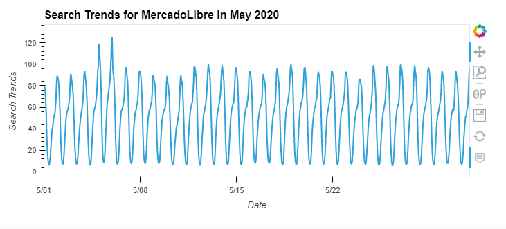
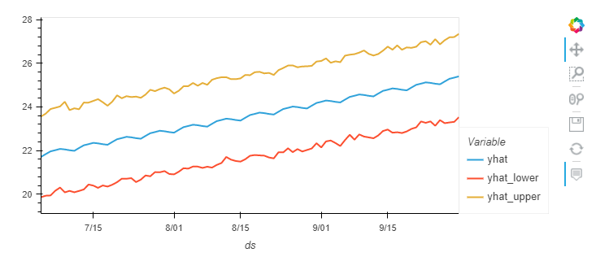

# Prophet_Forecasting

You’re a growth analyst at MercadoLibre. With over 200 million users, MercadoLibre is the most popular e-commerce site in Latin America. You've been tasked with analyzing the company's financial and user data in clever ways to make the company grow. So, you want to find out if the ability to predict search traffic can translate into the ability to successfully trade the stock.

This script is divided into four steps and an optional fifth step, as follows:

Step 1: Find unusual patterns in hourly Google search traffic

Step 2: Mine the search traffic data for seasonality

Step 3: Relate the search traffic to stock price patterns

Step 4: Create a time series model with Prophet

Step 5 (optional): Forecast revenue by using time series models

The following subsections detail these steps.

## Step 1: Find Unusual Patterns in Hourly Google Search Traffic
The data science manager asks if the Google search traffic for the company links to any financial events at the company. Or, does the search traffic data just present random noise? To answer this question, pick out any unusual patterns in the Google search data for the company, and connect them to the corporate financial events.



<br>

**Question:** Did the Google search traffic increase during the month that MercadoLibre released its financial results?

**Answer:** Google Search traffic increased during the month of May 2020, when MercadoLibre released its financial results, by 8.5%

---

## Step 2: Mine the Search Traffic Data for Seasonality
Marketing realizes that they can use the hourly search data, too. If they can track and predict interest in the company and its platform for any time of day, they can focus their marketing efforts around the times that have the most traffic. This will get a greater return on investment (ROI) from their marketing budget.

To that end, you want to mine the search traffic data for predictable seasonal patterns of interest in the company.


<br>

<br>

**Question:** Does any day-of-week effect that you observe concentrate in just a few hours of that day?

**Answer:** From the heatmap we can see that the search traffic is concentrated during the midnight hours. As far as the days of the week goes, the search traffic is the highest on Tuesdays and gradually decreases as the week progresses, peaking again during midnight hours of Tuesday
<br><br>

<br>
**Question:** Does the search traffic tend to increase during the winter holiday period (weeks 40 through 52)?

**Answer:** From the above bar graph, it dosen't seem like visually there is much difference in the serach traffic druring the winter holiday period as compared to the other weeks during the year.

---

## Step 3: Relate the Search Traffic to Stock Price Patterns
You mention your work on the search traffic data during a meeting with people in the finance group at the company. They want to know if any relationship between the search data and the company stock price exists, and they ask if you can investigate. To do so we calculate:

* “Stock Volatility”, which holds an exponentially weighted four-hour rolling average of the company’s stock volatility

* “Hourly Stock Return”, which holds the percent change of the company's stock price on an hourly basis


<br>

<br>
**Question:** Do both time series indicate a common trend that’s consistent with this narrative?
<br>
#### **Answer:** The Mercado stock close price does follow a trend which is consistent with the narrative, where there was a initial dip in the close price when the pandemic hit, but the price soon picked up and show an upward trend in the later months. For the google search trends however, this does not hold true. We do see a dip in the search trends on March 23rd, right around when the pandemic hit, and a spike on May 6th 2020, corresponding to a increase in stock close prices, but other than that the google search trends do not seem to be affected by the close prices or vice versa. 
<br>


<br>
#### **Question:** Does a predictable relationship exist between the lagged search traffic and the stock volatility or between the lagged search traffic and the stock price returns?

#### **Answer:** According to the correlation matrix, their exits if any a very weak relationship between lagged search traffic and the stock price returns. Also, between the lagged search traffic and stck volatility, there exits a very weak negative relationship, as in, Search trends tend to increase slightly when the volatility decreases and the search trend decres when volatility increases.
---
## Step 4: Create a Time Series Model with Prophet
Now, you need to produce a time series model that analyzes and forecasts patterns in the hourly search data.


<br>
Question: How's the near-term forecast for the popularity of MercadoLibre?

Answer: The neartime forecast predicts a decline in the popularity of MercadoLibre, maybe picking up again in October 2020
<br>


<br>


Question: What time of day exhibits the greatest popularity?

Answer: The midnight hours exhibit the greatest popularity

Question: Which day of week gets the most search traffic?

Answer: Tuesday gets the most search traffic

Question: What's the lowest point for search traffic in the calendar year?

#### Answer: The lowest point for search traffic in the calendar year is during the month of October
---
## Step 5 (Optional): Forecast Revenue by Using Time Series Models
A few weeks after your initial analysis, the finance group follows up to find out if you can help them solve a different problem. Your fame as a growth analyst in the company continues to grow!

Specifically, the finance group wants a forecast of the total sales for the next quarter. This will dramatically increase their ability to plan budgets and to help guide expectations for the company investors.


<br>


<br>
Question: For example, what are the peak revenue days? (Mondays? Fridays? Something else?)

#### Answer: Peak revenue days are Wednesdays


<br>

The above graph only shows the forecast till August 12th. To provide forecast for the entire quarter, the future has to go till September 30th. So we perform the Prophet analysis for 140 days to cover the full quarter till Sept 30th. 
<br>

<br>

#### Based on the forecast information generated above, produce a sales forecast for the finance division, giving them a number for expected total sales next quarter. Include best and worst case scenarios, to better help the finance team plan.
#### Answer: The expected total sales next quarter is 2163.61. The best case number for the total sales is 2338.12 and the worst case number is 1988.
---

## Technologies

This project uses python 3.7 along with the following packages:

* [JupyterLab](https://jupyterlab.readthedocs.io/en/stable/) - Web based user interface for data analysis.

* [Google Colab](https://colab.research.google.com/) - A research and education tool initiated by google for the exploration of algorithmic based tool for machine learning development

* [Facebook Prophet](https://facebook.github.io/prophet/) - A forecasting procedure for time series data based on an addtive model

* [pandas](https://github.com/pandas-dev/pandas) - Data analysis and manipulation library.

* [hvplot](https://pyviz-dev.github.io/hvplot/) - A high-level plotting API for the PyData ecosystem built on HoloViews.


---

## Installation Guide

Please install the following before starting the application

```python
  pip install jupyterlab
  pip install pandas
  pip install hvplot 
 ```

 If you do not wish to install Facebook Prophet, you can just open the .ipynb file from the google colab [link](https://colab.research.google.com/drive/11p_X30y2pIWbuqygJVGhn_5wKebvJynf?usp=sharing). Other wise install the following applications

 ```python
   pip install pystan
   conda install -c conda-forge fbprophet
```
---

## Usage

To use the Prophet forecasting tools, please download and open the **forecasting_net_prophet_colab.ipynb** in jupyter lab after executing
the following on the command line:

```python
jupyter lab
```
Jupytper Lab should open automatically in a browser. 
If it does not, please follow the instructions on the command line.

#### You can also use google colab to open the script using this [link](https://colab.research.google.com/drive/11p_X30y2pIWbuqygJVGhn_5wKebvJynf?usp=sharing)
---

## Contributors

Abhishika Fatehpuria (abhishika@gmail.com)

---

## License

MIT